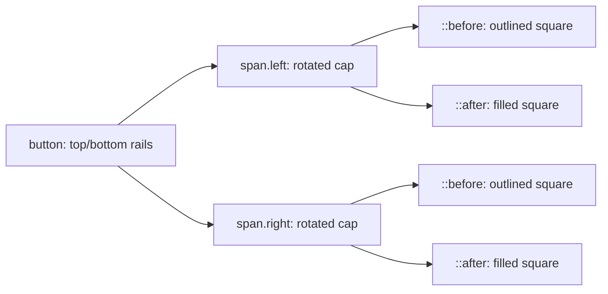

# Art Deco button border effect (CodePen MYgEPez)

Reference analysis for reusing the **button border** from **mubangadv** ([CodePen](https://codepen.io/mubangadv/pen/MYgEPez)) as a standalone effect.

## Sources

- [Art Deco Card — CodePen MYgEPez](https://codepen.io/mubangadv/pen/MYgEPez) — canonical pen URL.
- [CodePen fullpage render](https://cdpn.io/mubangadv/fullpage/MYgEPez) — exposed the rendered HTML/CSS used by the demo.

The analysis is based on the fullpage payload, which includes the real button markup and CSS.

---

## Architecture

This button border is not drawn with a normal full rectangle. Instead, it is assembled from:

1. top and bottom horizontal rails on the button itself
2. two rotated end-cap elements
3. a small outlined square and filled square attached to each end cap



The result looks like a stylized engraved button rather than a standard bordered rectangle.

---

## Markup

The button uses two decorative spans:

```html
<button>
  <span class="left"></span>
  <span class="right"></span>
  Button
</button>
```

Those spans are essential. Without them, you only get the horizontal top and bottom lines.

---

## Base button rails

The button itself only draws the horizontal border lines:

```css
button {
  all: unset;
  border-top: 1px solid var(--border);
  border-bottom: 1px solid var(--border);
  height: 2rem;
  padding: 0 1rem;
  position: relative;
  margin: 0 2rem;
}
```

### Important detail: no left/right border

That omission is deliberate. The side geometry comes from the rotated `.left` and `.right` elements instead of `border-left` / `border-right`.

This is what gives the button its chamfered, jewel-like silhouette.

---

## Rotated end caps

Each side ornament starts as the same base shape:

```css
button .left,
button .right {
  position: absolute;
  width: 1.45rem;
  height: 1.45rem;
  border-bottom: 1px solid var(--border);
  border-left: 1px solid var(--border);
}
```

Then each one is rotated:

```css
button .left {
  left: -0.75rem;
  transform: rotate(45deg);
}

button .right {
  right: -0.75rem;
  transform: rotate(-135deg);
}
```

### Why this works

By drawing only two border sides on a square and rotating it, the code creates a diagonal end piece that reads like an angled cap or pointed bracket.

This is much simpler than drawing the silhouette with clip-path or SVG, but visually it feels custom.

---

## Decorative square + square dot

Each end cap gets two more details:

```css
button .left::before,
button .right::before {
  content: "";
  width: 0.75rem;
  height: 0.75rem;
  border: 1px solid var(--border);
  position: absolute;
  top: calc(1rem - 1px);
  left: calc(-0.4rem - 1px);
}

button .left::after,
button .right::after {
  content: "";
  width: 0.5rem;
  height: 0.5rem;
  background: var(--border);
  position: absolute;
  top: calc(1rem - 1px);
  left: calc(-0rem - 1px);
}
```

### Visual role of each pseudo-element

| Part | Effect |
| --- | --- |
| `::before` | A small outlined square that echoes the Deco frame language. |
| `::after` | A filled square that acts like a jewel, stud, or capstone. |

This combination is why the button border feels related to the card border without literally repeating the same construction.

---

## Hover behavior

The button changes the fill behind the geometry:

```css
button:hover {
  background: var(--button-hover);
}

button:hover .left,
button:hover .right {
  background: var(--button-hover);
}
```

That second rule matters because the rotated end caps are separate elements. If only the button background changed, the angled caps would remain transparent and the hover state would look broken.

---

## Minimal reference

```html
<button class="deco-button">
  <span class="left"></span>
  <span class="right"></span>
  Button
</button>
```

```css
.deco-button {
  all: unset;
  border-top: 1px solid var(--border);
  border-bottom: 1px solid var(--border);
  height: 2rem;
  padding: 0 1rem;
  position: relative;
  margin: 0 2rem;
  cursor: pointer;
}

.deco-button .left,
.deco-button .right {
  position: absolute;
  width: 1.45rem;
  height: 1.45rem;
  border-bottom: 1px solid var(--border);
  border-left: 1px solid var(--border);
}

.deco-button .left {
  left: -0.75rem;
  transform: rotate(45deg);
}

.deco-button .right {
  right: -0.75rem;
  transform: rotate(-135deg);
}
```

---

## Why this is reusable

This approach is a nice middle ground:

- more distinctive than a normal bordered button
- lighter than an SVG or clip-path implementation
- easy to recolor through one border variable
- easy to animate because each piece is still plain CSS

It works especially well for luxe, Art Deco, or ornamental UI systems.

---

## Porting notes

- `all: unset` removes native button styling, so re-add accessibility affordances like `:focus-visible` in production.
- The end-cap positioning is tuned to the current `height: 2rem`; if you resize the button vertically, the pseudo-element offsets will probably need adjustment.
- If you want thicker strokes, update the border widths and re-tune the `calc(... - 1px)` offsets so the joins still line up cleanly.
- The construction also works on links styled as buttons if you keep `position: relative` and the extra spans.

---

## Gotchas and limitations

| Topic | Notes |
| --- | --- |
| Extra markup | Needs two span elements for the side ornaments. |
| Focus styles | `all: unset` strips native focus UI, so accessibility needs follow-up work. |
| Scaling | The geometry is tightly tuned to this button height and can drift when resized. |
| Text overflow | Very narrow buttons can collide visually with the decorative end caps. |

---

## Summary

The button border effect is built from **top and bottom rails on the button**, plus **two rotated side caps** that carry an outlined square and a filled square ornament. It creates a faceted, Art Deco silhouette using only normal elements, borders, transforms, and pseudo-elements. The main tradeoff is that the geometry is deliberately hand-tuned, so large size changes usually require a little re-alignment.
