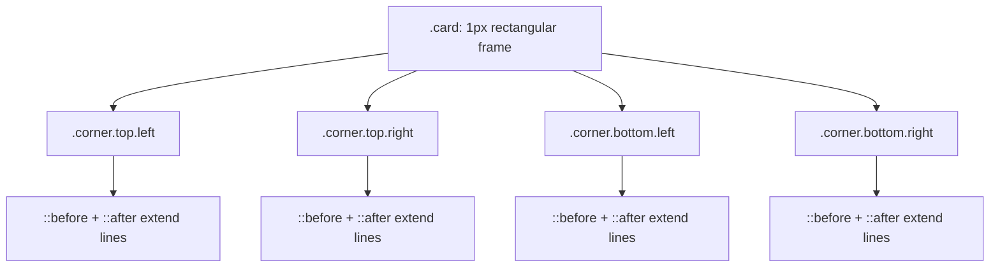

# Art Deco card border effect (CodePen MYgEPez)

Reference analysis for reusing the **outer border around the card** from **mubangadv** ([CodePen](https://codepen.io/mubangadv/pen/MYgEPez)) without re-deriving the geometry from scratch.

## Sources

- [Art Deco Card — CodePen MYgEPez](https://codepen.io/mubangadv/pen/MYgEPez) — canonical pen URL.
- [CodePen fullpage render](https://cdpn.io/mubangadv/fullpage/MYgEPez) — exposed the rendered HTML/CSS used by the demo.

The direct `codepen.io` page was not used for source extraction here; the analysis is based on the `cdpn.io` fullpage payload, which includes the actual markup and styles.

---

## Architecture

The card frame is not a single complex border image. It is a **plain rectangular border** plus **four absolutely positioned corner ornaments**.



| Layer | Role |
| --- | --- |
| `.card` | Provides the main rectangular card body and the base `1px solid` border. |
| `.corner` | A tiny square placed just outside each corner of the card. |
| `.corner::before` | Extends one leg of the decorative corner. |
| `.corner::after` | Extends the other leg of the decorative corner. |

This is a useful pattern because the main border stays simple, while the “Art Deco” personality lives only in the corner pieces.

---

## Base card border

The card itself is straightforward:

```css
.card {
  background: var(--background);
  width: 20rem;
  height: 30rem;
  border: 1px solid var(--border);
  position: relative;
  padding: 1rem;
}
```

### Why `position: relative` matters

The decorative corners are absolutely positioned. Without `position: relative` on `.card`, those corner pieces would be positioned relative to some ancestor instead of the card itself.

The visible frame therefore has two parts:

1. A normal rectangular border around the entire card
2. Four ornaments that protrude slightly past the corners

---

## Corner construction

Each corner starts from the same base square:

```css
.card .corner {
  width: 0.5rem;
  height: 0.5rem;
  border: 1px solid var(--border);
  position: absolute;
}
```

This creates a tiny outlined box at each corner. The class combinations like `.top.left` or `.bottom.right` then move that box just outside the card edge:

```css
.card .corner.left { left: -0.5rem; }
.card .corner.right { right: -0.5rem; }
.card .corner.top { top: -0.5rem; }
.card .corner.bottom { bottom: -0.5rem; }
```

Because the box is offset by exactly its own size, it appears to “hang” off the outer border.

---

## The pseudo-elements that create the Deco lines

The real magic is in the pseudo-elements:

```css
.card .corner::after,
.card .corner::before {
  content: "";
  position: absolute;
}

.card .corner::after {
  width: 2rem;
  height: calc(1rem - 1px);
}

.card .corner::before {
  width: calc(1rem - 1px);
  height: 2rem;
}
```

These pseudo-elements are not fully bordered rectangles. Instead, the directional variants selectively apply just one edge:

```css
.card .corner.left::after { border-left: 1px solid var(--border); }
.card .corner.left::before { border-left: 1px solid var(--border); }

.card .corner.right::after { border-right: 1px solid var(--border); }
.card .corner.right::before { border-right: 1px solid var(--border); }

.card .corner.top::after { border-top: 1px solid var(--border); }
.card .corner.top::before { border-top: 1px solid var(--border); }

.card .corner.bottom::after { border-bottom: 1px solid var(--border); }
.card .corner.bottom::before { border-bottom: 1px solid var(--border); }
```

### What this produces visually

Each corner ornament becomes:

- one small square at the extreme corner
- one short horizontal extension
- one short vertical extension

That layered geometry is what gives it the “machine-cut Art Deco” look instead of a standard card border.

---

## Direction-specific placement

The pseudo-elements are nudged differently depending on side:

```css
.card .corner.left::after {
  left: calc(-2px + 1rem);
}

.card .corner.left::before {
  left: -1px;
}

.card .corner.top::after {
  top: -1px;
}

.card .corner.top::before {
  top: calc(-2px + 1rem);
}
```

The repeated `-1px` / `calc(... - 2px + 1rem)` offsets are there to visually line up the ornament strokes with the main `1px` border and avoid tiny gaps caused by border thickness.

This is one of those effects where the layout is conceptually simple but the final polish depends on **pixel nudging**.

---

## Minimal reference

```html
<div class="card">
  <div class="corner top left"></div>
  <div class="corner top right"></div>
  <div class="corner bottom left"></div>
  <div class="corner bottom right"></div>
  ...
</div>
```

```css
.card {
  border: 1px solid var(--border);
  position: relative;
}

.card .corner {
  width: 0.5rem;
  height: 0.5rem;
  border: 1px solid var(--border);
  position: absolute;
}

.card .corner::before,
.card .corner::after {
  content: "";
  position: absolute;
}

.card .corner::after {
  width: 2rem;
  height: calc(1rem - 1px);
}

.card .corner::before {
  width: calc(1rem - 1px);
  height: 2rem;
}

.card .corner.left { left: -0.5rem; }
.card .corner.right { right: -0.5rem; }
.card .corner.top { top: -0.5rem; }
.card .corner.bottom { bottom: -0.5rem; }
```

---

## Why this is reusable

Compared with using an SVG border or a `border-image`, this approach:

- keeps the main border editable in plain CSS
- lets you independently tune corner ornament size
- works with arbitrary card backgrounds
- avoids raster scaling issues

It is especially good when you want **simple geometry with bespoke corners**.

---

## Porting notes

- If you change the main card border thickness, you will probably also need to adjust the `-1px` and `-2px` offsets.
- If you scale the ornament up, keep the base square, horizontal arm, and vertical arm proportional or the Deco rhythm starts to feel off.
- You can move the card border inward by keeping the ornament outside, which preserves the “framed plaque” feeling.
- This pattern ports well to CSS modules, Tailwind component classes, or styled-components because it is just a handful of absolutely positioned elements.

---

## Gotchas and limitations

| Topic | Notes |
| --- | --- |
| Extra markup | The effect needs four extra elements for the corners. |
| Pixel tuning | Border joins rely on small hard-coded offsets; changing stroke width may require re-tuning. |
| Small cards | On very small cards, the corner ornaments can feel oversized relative to the frame. |
| Rounded corners | This construction assumes sharp corners; it does not naturally adapt to rounded cards. |

---

## Summary

The card border effect is a **plain 1px card frame** enhanced by **four modular corner ornaments**. Each ornament is built from a tiny outlined square plus two pseudo-elements that draw short extending rails. The result is lightweight, themeable, and much easier to maintain than an image-based frame, with the main tradeoff being a bit of extra markup and pixel-level alignment work.
