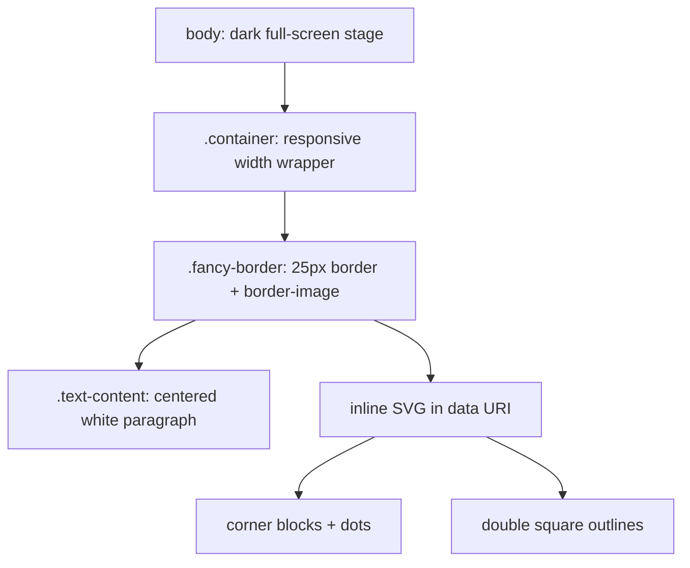

# Fancy SVG border effect (CodePen VwJojbZ)

Reference analysis for reusing the responsive ornamental border from **Fotek** ([CodePen](https://codepen.io/Fotek/pen/VwJojbZ)) without having to reverse-engineer it again later.

## Sources

- [Fancy SVG Border - Responsive — CodePen VwJojbZ](https://codepen.io/Fotek/pen/VwJojbZ) — canonical pen URL referenced by the fullpage payload.
- [CodePen fullpage render](https://cdpn.io/Fotek/fullpage/VwJojbZ) — exposed the exact HTML/CSS used in the demo, including the inline `border-image` SVG.

The direct `codepen.io` page was Cloudflare-blocked from this environment, so the analysis below is based on the **fullpage payload** served from `cdpn.io`, which includes the actual rendered source.

---

## Architecture

This effect is intentionally simple: the visual interest comes almost entirely from **`border-image` fed by an inline SVG data URI**.



| Layer | Role |
| --- | --- |
| `body` | Creates a presentation stage: `background: #101010`, full viewport height, and flex centering in both axes. |
| `.container` | Constrains width with `width: 50%` and `max-width: 1480px` so the bordered block scales with the viewport. |
| `.fancy-border` | The actual effect layer. It sets a physical border (`25px solid #fff`) and then replaces the painted border with `border-image`. |
| `.text-content` | Plain centered white text inside the border. No filter, masking, pseudo-elements, or JS are involved. |

There is **no JavaScript** in the pen. The responsiveness comes from normal layout rules, not measurement or resize handlers.

---

## Core technique: `border-image` + SVG data URI

The border is drawn with this CSS pattern:

```css
.fancy-border {
  border: 25px solid #fff;
  border-image: url("data:image/svg+xml,...") 25;
}
```

### Why this works

`border-image` takes an image source, slices it into regions, and maps those regions onto the element's border box:

1. The element first declares a **real border width**: `25px`.
2. `border-image` replaces the normal solid border paint with an **image-based border**.
3. The `25` slice value tells the browser how to cut the SVG image into the usual 9-slice border grid:
   - 4 corners
   - 4 edges
   - 1 center region
4. Because the source is an **SVG**, the ornament stays crisp when scaled.

This is the key idea: the effect looks decorative and custom, but the implementation is still just one CSS declaration on a single element.

---

## The embedded SVG

The pen encodes the entire ornament as a data URI:

```svg
<svg xmlns="http://www.w3.org/2000/svg" width="75" height="75">
  <g fill="none" stroke="#B88846" stroke-width="2">
    <path d="M1 1h73v73H1z"/>
    <path d="M8 8h59v59H8z"/>
    <path d="M8 8h16v16H8zM51 8h16v16H51zM51 51h16v16H51zM8 51h16v16H8z"/>
  </g>
  <g fill="#B88846">
    <circle cx="16" cy="16" r="2"/>
    <circle cx="59" cy="16" r="2"/>
    <circle cx="59" cy="59" r="2"/>
    <circle cx="16" cy="59" r="2"/>
  </g>
</svg>
```

### Visual breakdown

| SVG part | Effect |
| --- | --- |
| Outer square (`M1 1h73v73H1z`) | Creates the outer gold ring near the border edge. |
| Inner square (`M8 8h59v59H8z`) | Adds a second inset ring for a framed / engraved look. |
| Four corner squares | Makes each corner feel more ornamental than a plain line border. |
| Four circles | Adds small accent dots inside the corner boxes. |

The color `#B88846` gives the border a brass / antique-gold feel against the dark background.

---

## How the slices map

The SVG is `75x75`, while the slice value is `25`.

That means the browser conceptually cuts the source image at:

- `25px` from the top
- `25px` from the right
- `25px` from the bottom
- `25px` from the left

This leaves:

- Corner regions that preserve the decorative square-and-dot motifs
- Edge regions that can stretch along each side
- A center region that is ignored for normal border rendering

Because the artwork was designed with strong corner features, it survives border scaling well. This is the main reason the effect still looks intentional when the content box becomes much wider.

---

## Layout and responsiveness

The pen uses:

```css
body {
  background: #101010;
  display: flex;
  align-items: center;
  justify-content: center;
  min-height: 100vh;
}

.container {
  display: flex;
  max-width: 1480px;
  width: 50%;
}
```

### What this gives you

- The demo is vertically and horizontally centered on the page.
- The bordered block occupies **50% of viewport width**, up to `1480px`.
- The border itself automatically scales to the element's final dimensions.

### What is missing

The pen does **not** include a mobile breakpoint. On small screens, `width: 50%` may become too narrow for comfortable reading, so a production version should usually add something like:

```css
.container {
  width: min(90vw, 1480px);
}
```

or a media query that widens the block on phones.

---

## Why SVG is a good fit here

Compared with alternatives:

| Approach | Tradeoff |
| --- | --- |
| `border-image` + SVG | Crisp, compact, single-element solution, easy to recolor by editing the SVG. |
| PNG border image | Works, but can blur on scaling and needs multiple assets for higher fidelity. |
| Pseudo-elements with many gradients | More editable in CSS, but much more verbose and harder to keep symmetrical. |
| Inline SVG wrapper around content | More flexible, but more markup and trickier sizing if you only want a decorative frame. |

This pen chooses the lowest-complexity option that still looks custom.

---

## Minimal reference

```html
<section class="container">
  <div class="fancy-border">
    <p class="text-content">
      Lorem ipsum dolor sit amet...
    </p>
  </div>
</section>
```

```css
body {
  background: #101010;
  display: flex;
  align-items: center;
  justify-content: center;
  min-height: 100vh;
}

.container {
  display: flex;
  width: 50%;
  max-width: 1480px;
}

.text-content {
  color: #fff;
  text-align: center;
}

.fancy-border {
  display: flex;
  border: 25px solid #fff;
  border-image: url("data:image/svg+xml,%3Csvg xmlns='http://www.w3.org/2000/svg' width='75' height='75'%3E%3Cg fill='none' stroke='%23B88846' stroke-width='2'%3E%3Cpath d='M1 1h73v73H1z'/%3E%3Cpath d='M8 8h59v59H8z'/%3E%3Cpath d='M8 8h16v16H8zM51 8h16v16H51zM51 51h16v16H51zM8 51h16v16H8z'/%3E%3C/g%3E%3Cg fill='%23B88846'%3E%3Ccircle cx='16' cy='16' r='2'/%3E%3Ccircle cx='59' cy='16' r='2'/%3E%3Ccircle cx='59' cy='59' r='2'/%3E%3Ccircle cx='16' cy='59' r='2'/%3E%3C/g%3E%3C/svg%3E") 25;
}
```

---

## Porting notes

- Keep the **`border-width`** and **slice value** aligned. Here both are `25`, which makes the mapping predictable.
- If you want easier maintenance, move the SVG out of the data URI into a standalone asset and reference it with `url("/borders/fancy-frame.svg")`.
- If the border looks distorted, check the default `border-image-repeat` behavior and consider explicitly setting `stretch`, `round`, or `repeat` depending on the desired edge treatment.
- Add inner padding in production if the content gets too close to the frame; the demo relies on the paragraph's natural spacing.
- For theme variants, the easiest change is the SVG stroke / fill color `#B88846`.

---

## Gotchas and limitations

| Topic | Notes |
| --- | --- |
| Edge scaling | `border-image` can stretch edge artwork in ways that look great for geometric motifs but bad for highly detailed ornaments. |
| Data URI maintenance | Editing encoded SVG inside CSS is annoying; external files are easier to iterate on. |
| Mobile readability | `width: 50%` is not phone-friendly by default. |
| Padding | The pen does not define explicit inner spacing on `.fancy-border`, so real content may need padding. |
| Complex corner art | If the corner motifs become too intricate, slice tuning gets finicky fast. |

---

## Summary

This effect is a **single-element ornamental frame** built with `border-image` and an **inline SVG tile**. The SVG contains two square rings, four corner blocks, and four dots; the browser slices that image with `25`-pixel insets and paints it around a normal bordered element. The result is lightweight, crisp, and easy to reuse, with the main caveat that production use should add **padding** and **better small-screen width rules**.
