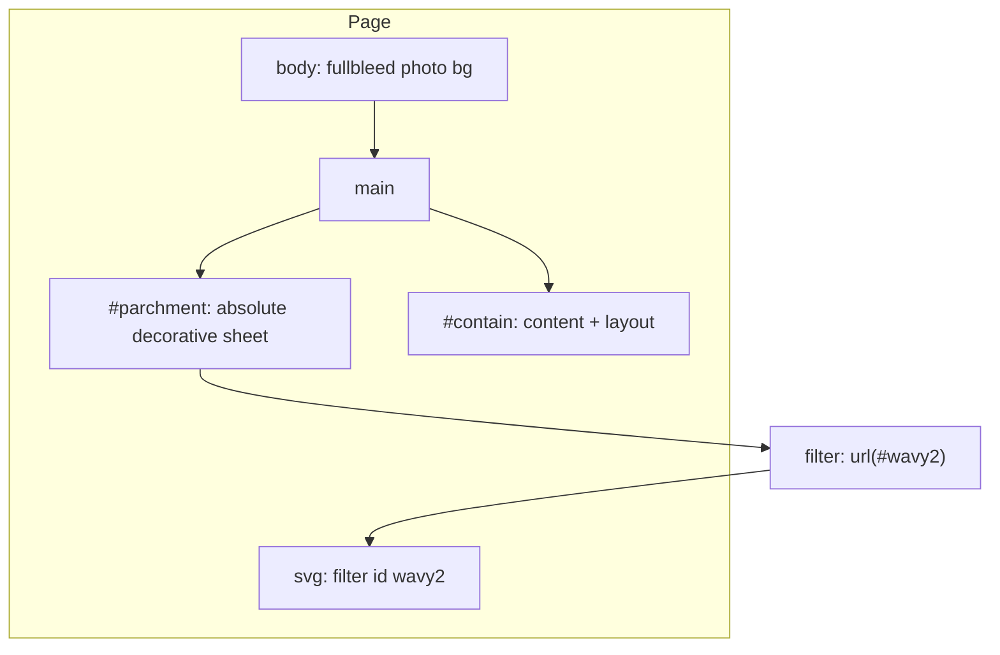

# Old parchment effect (CodePen NWPbOxL)

Reference analysis for reusing the “old parchment” look from **Christophe** ([AgnusDei](https://codepen.io/AgnusDei)) without re-deriving it from scratch.

## Sources

- [Old parchment v.2.3 — CodePen NWPbOxL](https://codepen.io/AgnusDei/pen/NWPbOxL) — CSS + SVG `feTurbulence`, noise tile, fold overlay, typography.
- [Stack Overflow answer by Christophe](https://stackoverflow.com/a/63615485) — documents the core `#parchment` styling and inline `<filter id="wavy2">` chain (same pen linked).

The pen lists an external JS resource (`bGExVLO`); this doc treats the **authoritative filter** as the inline SVG pattern from the SO answer / pen description. If you need that script’s behavior, inspect it in the browser on CodePen.

---

## Architecture

The layout intentionally **splits** the visible “paper” from the **content** that defines height:



| Layer | Role |
| --- | --- |
| `body` | Full-viewport background photo (`background-size: cover`) and base font. Fluid type: `--fontSize: calc((1vw + 1vh) * .75)`. |
| `#contain` | `position: relative`, flex column, ~75% width, horizontal centering (`margin: 0 auto`), padding. Holds all real content (title, paragraphs, images). **Not** given the SVG displacement filter. |
| `#parchment` | `position: absolute`, same width and horizontal center (`left: 50%`, `transform: translate(-50%, 0)`). Cream fill `#fffef0`, strong outer + **inset** box-shadow (brown `#8f5922`) for a burned / aged edge. Receives `filter: url(#wavy2)` so only the “sheet” warps. |
| JS `ScrollHeight()` | Sets `#parchment.style.height` from `#contain.offsetHeight` on load and `resize`. Keeps the filtered sheet exactly as tall as the content box without applying the filter to text. |

Stacking: siblings under `main`; later DOM (`#contain`) paints **above** `#parchment` if both overlap and neither uses `z-index`. Adjust `z-index` if you reorder nodes or add backgrounds.

---

## SVG filter: wavy / organic edges

Applied via CSS: `filter: url(#wavy2);` on `#parchment`.

### Primitives

1. **`feTurbulence`** — Procedural Perlin-style noise. Its output is used as a **displacement map** (not drawn directly).
   - **`baseFrequency`** — Spatial frequency (higher → finer grain). Pen / SO use `0.02` as a starting point.
   - **`numOctaves`** — Detail layers; more octaves → richer, costlier noise (SO: `5`).
   - **`seed`** — Reproducible variation (SO: `1`).
   - **`type`** — Default `turbulence` is typical for organic warp.

2. **`feDisplacementMap`** — Shifts pixels of the **source graphic** using the turbulence channel values.
   - **`in="SourceGraphic"`** — Warp the element’s own painted output (the parchment rectangle, shadows, backgrounds on that element).
   - **`scale`** — Displacement strength in user units (SO: `20`). Increase for stronger waviness; decrease for subtler edges.

Tuning: adjust **`scale`** first for obvious edge warp; then **`baseFrequency`** / **`numOctaves`** for texture scale and detail.

### Minimal reference (from SO / pen)

```html
<svg xmlns="http://www.w3.org/2000/svg" style="position: absolute; width: 0; height: 0;">
  <filter id="wavy2">
    <feTurbulence x="0" y="0" baseFrequency="0.02" numOctaves="5" seed="1" />
    <feDisplacementMap in="SourceGraphic" scale="20" />
  </filter>
</svg>
```

Hide the SVG visually with zero size or off-screen placement; keep it in the DOM so `url(#wavy2)` resolves.

---

## CSS layers on `#parchment` (v2.x)

1. **Base color** — `background: #fffef0` (warm paper).
2. **Vellum noise (v2.2)** — `background-image: url(data:image/png;base64,...)` — a small **repeating** PNG tile for fine grain. The pen embeds a full data URI; for maintenance, replace with a hosted asset or CSS noise if you prefer.
3. **Box shadow** — Outer drop (`2px 3px 20px black`) plus large inset glow (`0 0 125px #8f5922 inset` in v2.3) for depth and aged edges.
4. **Fold shading (v2.3)** — `#parchment::after` with `content: ""`, `position: absolute`, full width/height, and a **`conic-gradient`** mixing translucent whites and brownish stops to suggest creases and uneven light. Author notes this block can be removed if folds are unwanted.

### Core `#parchment` reference (adapt sizes to your layout)

```css
#parchment {
  position: absolute;
  display: flex;
  width: 75%;
  top: 0;
  left: 50%;
  transform: translate(-50%, 0);
  margin: 2em 0;
  padding: 4em;
  box-shadow: 2px 3px 20px black, 0 0 125px #8f5922 inset;
  background: #fffef0;
  filter: url(#wavy2);
  /* optional: background-image noise tile */
}
```

---

## JavaScript: height sync

```javascript
function syncParchmentHeight() {
  const parchment = document.querySelector("#parchment");
  const contain = document.querySelector("#contain");
  if (!parchment || !contain) return;
  parchment.style.height = `${contain.offsetHeight}px`;
}

window.addEventListener("resize", syncParchmentHeight);
// Prefer DOMContentLoaded over the pen's document.onload (see Gotchas).
document.addEventListener("DOMContentLoaded", syncParchmentHeight);
```

---

## Typography (pen-specific)

- Body text: **Bilbo Swash Caps** (Google Fonts), brown `#7F3300`, large line height.
- Title: **Pirata One**, centered, gray.
- Drop cap on paragraphs after the first: `::first-letter` with **Morris Initialen** (cdnfonts) and light `text-shadow`.

These are aesthetic only; the parchment **surface** effect is independent of fonts.

---

## Gotchas and limitations

| Topic | Notes |
| --- | --- |
| **Browser support** | Author warns the approach may fail in some browsers. SO cites **Chrome 92+, Firefox 90+, Edge 92+**. Test **Safari** for `filter: url(#id)` + `feDisplacementMap` if you support it. |
| **`document.onload`** | The pen assigns `document.onload = ScrollHeight()`. **`document.onload` is not standard**; use `window.onload` or `DOMContentLoaded` (or framework equivalents). |
| **`main` typo** | Pen uses `postion: relative` — should be `position`. |
| **Performance** | Displacement filters can be expensive on large layers. The PNG tile is cheap; turbulence + displacement dominates cost. |
| **Third-party assets** | Background photo (Unsplash), fonts, and optional external scripts depend on **live URLs** and licenses — mirror or self-host for production. |
| **Accessibility** | Low-contrast decorative backgrounds behind text can fail contrast; validate **ink vs paper** if text sits on the parchment layer. |
| **Export / screenshots** | Tools that rasterize DOM may flatten or mishandle SVG filters — test html-to-image / print / PDF if relevant. |

---

## Porting checklist (e.g. React / Next)

- [ ] Inline **hidden** `<svg>` with `<filter id="wavy2">` in a layout that wraps the page (or use a unique ID per instance if multiple sheets).
- [ ] Render **content** in a relatively positioned container; render **parchment** as a sibling behind it (or use explicit `z-index`).
- [ ] Sync heights with **`ResizeObserver`** on the content container (or measure after layout) instead of only `resize` if content height changes without viewport resize.
- [ ] Use **CSS modules / Tailwind** equivalents for the same properties; `filter: url(#wavy2)` must resolve in the final document.
- [ ] Verify **Safari** and mobile if you ship broadly.
- [ ] Replace data-URI noise with a **versioned asset** if bundle size or caching matters.

---

## Summary

The effect is **cream paper + inset shadow + SVG turbulence displacement** on a dedicated layer, optional **noise tile** and **conic-gradient folds**, with **JS (or ResizeObserver) height sync** so text stays sharp while the sheet matches content height. Start from the SO filter snippet and the `#parchment` / `#contain` split; tune `scale` and `baseFrequency` before chasing smaller details.
